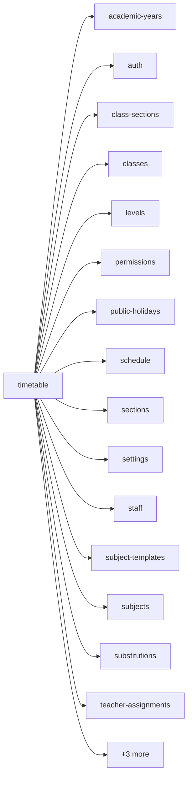

<!-- AUTO-GENERATED by scripts/generate-module-deps — do not edit -->

# Timetable

## Dependency summary

| Fan-out | Fan-in | Hub rank | Blast radius | Dependency rate | Type |
|---------|--------|----------|--------------|-----------------|------|
| 17 | 2 | 28/61 | 2 | 31% | Standard |

- **Backend module:** `backend/src/modules/timetable/timetable.module.ts`
- **Frontend feature:** `frontend/src/components/features/timetable`
- **Category:** Academic Structure

## Depends on (outbound)

| Module | Layer | Via | Condition |
|--------|-------|-----|----------|
| academic-years | BE module, BE service, FE feature | backend/src/modules/timetable/timetable.module.ts imports; backend/src/modules/timetable/timetable.service.ts → AcademicYearsService | — |
| auth | FE feature | components/features/timetable | — |
| class-sections | FE feature | components/features/timetable | — |
| classes | FE feature | components/features/timetable | — |
| levels | FE feature | components/features/timetable | — |
| permissions | FE feature | components/features/timetable | — |
| public-holidays | FE feature | components/features/timetable | — |
| schedule | BE module, BE service | backend/src/modules/timetable/timetable.module.ts imports; backend/src/modules/timetable/timetable.service.ts → ScheduleService | — |
| sections | FE feature | components/features/timetable | — |
| settings | FE feature | components/features/timetable | — |
| staff | BE module, FE feature | backend/src/modules/timetable/timetable.module.ts imports; components/features/timetable | — |
| subject-templates | FE feature | components/features/timetable | — |
| subjects | FE feature | components/features/timetable | — |
| substitutions | FE feature | components/features/timetable | — |
| teacher-assignments | BE module, BE service, FE feature | backend/src/modules/timetable/timetable.module.ts imports; backend/src/modules/timetable/timetable.service.ts → TeacherAssignmentsService | — |
| timetable | FE feature | components/features/timetable | — |
| timing-templates | FE feature | components/features/timetable | — |
| vacations | FE feature | components/features/timetable | — |

## Depended on by (inbound)

| Consumer | Layer | Via | Condition |
|----------|-------|-----|----------|
| dashboard | FE feature | components/features/dashboard | — |
| dashboard | FE feature | widget:schedule_today | — |
| dashboard | FE feature | widget:today_schedule | — |
| early-departure | BE module | backend/src/modules/early-departure/early-departure.module.ts imports | — |
| early-departure | BE service | backend/src/modules/early-departure/early-departure.service.ts → TimetableService | — |
| hook:useTimetable | FE hook | /api/v1/timetable | — |
| sidebar | FE nav | /children-timetable | RBAC feature timetable_personal |
| sidebar | FE nav | /my-schedule | RBAC feature timetable_personal |
| sidebar | FE nav | /my-timetable | RBAC feature timetable_personal |
| sidebar | FE nav | /timetable | RBAC feature timetable_management |
| sidebar | FE nav | /conflict-management | RBAC feature conflict_management |
| timetable | FE feature | components/features/timetable | — |

## Access gates

| Gate type | Condition | Applies to | Source |
|-----------|-----------|------------|--------|
| jwt | JwtAuthGuard | timetable API | `backend/src/modules/timetable/timetable.controller.ts` |
| branch | BranchGuard (X-Branch-Id) | timetable API | `backend/src/modules/timetable/timetable.controller.ts` |
| rbac | ensureFeatureEditAccess('timetable_management') | timetable write endpoints | `backend/src/modules/timetable/timetable.controller.ts` |
| nav-rbac | canView('timetable_personal') | nav path /children-timetable | `frontend/src/lib/permission/navFeatureMap.ts` |
| nav-rbac | canView('timetable_personal') | nav path /my-timetable | `frontend/src/lib/permission/navFeatureMap.ts` |
| nav-rbac | canView('timetable_management') | nav path /timetable | `frontend/src/lib/permission/navFeatureMap.ts` |

## Database tables

| Table | Source file |
|-------|-------------|
| `class_sections` | `backend/src/modules/timetable/timetable.service.ts` |
| `class_subject_template_assignments` | `backend/src/modules/timetable/timetable.service.ts` |
| `class_timing_assignments` | `backend/src/modules/timetable/timetable.service.ts` |
| `classes` | `backend/src/modules/timetable/timetable.service.ts` |
| `features` | `backend/src/modules/timetable/timetable.controller.ts` |
| `level_classes` | `backend/src/modules/timetable/timetable.service.ts` |
| `level_subject_template_assignments` | `backend/src/modules/timetable/timetable.service.ts` |
| `profiles` | `backend/src/modules/timetable/timetable.service.ts` |
| `role_permissions` | `backend/src/modules/timetable/timetable.controller.ts` |
| `roles` | `backend/src/modules/timetable/timetable.controller.ts` |
| `sections` | `backend/src/modules/timetable/timetable.service.ts` |
| `staff` | `backend/src/modules/timetable/timetable.service.ts` |
| `student_subject_template_assignments` | `backend/src/modules/timetable/timetable.service.ts` |
| `students` | `backend/src/modules/timetable/timetable.service.ts` |
| `subject_template_subjects` | `backend/src/modules/timetable/timetable.service.ts` |
| `subject_templates` | `backend/src/modules/timetable/timetable.service.ts` |
| `timetable_slots` | `backend/src/modules/timetable/timetable.service.ts` |
| `timing_template_slots` | `backend/src/modules/timetable/timetable.service.ts` |
| `timing_templates` | `backend/src/modules/timetable/timetable.service.ts` |

## Troubleshooting

| Symptom | Likely cause | Check first |
|---------|--------------|-------------|
| API 401/403 | Auth, branch, or permission gate | Controller guards + `ensureFeatureEditAccess` |
| Empty list or wrong branch data | Missing branch_id filter | Service `.eq('branch_id', branchId)` |
| Frontend not loading data | Hook or API mismatch | `frontend/src/hooks/` + Network tab |

## Dependency graph

