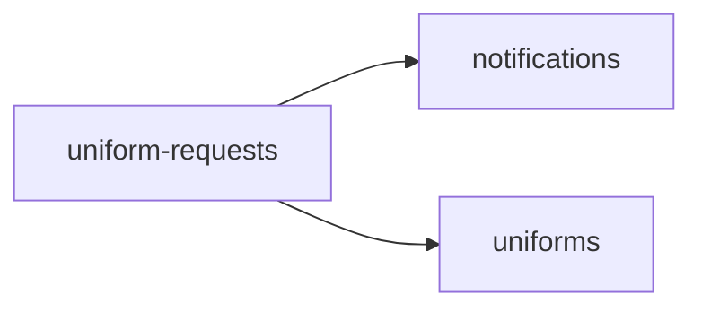

<!-- AUTO-GENERATED by scripts/generate-module-deps — do not edit -->

# Uniform Requests

## Dependency summary

| Fan-out | Fan-in | Hub rank | Blast radius | Dependency rate | Type |
|---------|--------|----------|--------------|-----------------|------|
| 2 | 1 | 47/61 | 1 | 5% | Standard |

- **Backend module:** `backend/src/modules/uniform-requests/uniform-requests.module.ts`
- **Category:** Uniforms & Inventory

## Depends on (outbound)

| Module | Layer | Via | Condition |
|--------|-------|-----|----------|
| notifications | BE module, BE service | backend/src/modules/uniform-requests/uniform-requests.module.ts imports; backend/src/modules/uniform-requests/uniform-requests.service.ts → NotificationsService | — |
| uniforms | BE module, BE service | backend/src/modules/uniform-requests/uniform-requests.module.ts imports; backend/src/modules/uniform-requests/uniform-requests.service.ts → UniformsService | — |

## Depended on by (inbound)

| Consumer | Layer | Via | Condition |
|----------|-------|-----|----------|
| hook:useUniformRequests | FE hook | /api/v1/uniform-requests | — |
| inventory | FE feature | components/features/inventory | — |

## Access gates

| Gate type | Condition | Applies to | Source |
|-----------|-----------|------------|--------|
| jwt | JwtAuthGuard | uniform-requests API | `backend/src/modules/uniform-requests/uniform-requests.controller.ts` |
| branch | BranchGuard (X-Branch-Id) | uniform-requests API | `backend/src/modules/uniform-requests/uniform-requests.controller.ts` |
| rbac | ensureFeatureEditAccess('inventory') | uniform-requests write endpoints | `backend/src/modules/uniform-requests/uniform-requests.controller.ts` |

## Database tables

| Table | Source file |
|-------|-------------|
| `features` | `backend/src/modules/uniform-requests/uniform-requests.controller.ts` |
| `profiles` | `backend/src/modules/uniform-requests/uniform-requests.service.ts` |
| `role_permissions` | `backend/src/modules/uniform-requests/uniform-requests.controller.ts` |
| `roles` | `backend/src/modules/uniform-requests/uniform-requests.controller.ts` |
| `students` | `backend/src/modules/uniform-requests/uniform-requests.service.ts` |
| `uniform_issuances` | `backend/src/modules/uniform-requests/uniform-requests.service.ts` |
| `uniform_items` | `backend/src/modules/uniform-requests/uniform-requests.service.ts` |
| `uniform_request_items` | `backend/src/modules/uniform-requests/uniform-requests.service.ts` |
| `uniform_requests` | `backend/src/modules/uniform-requests/uniform-requests.service.ts` |
| `uniform_stock` | `backend/src/modules/uniform-requests/uniform-requests.service.ts` |
| `user_roles` | `backend/src/modules/uniform-requests/uniform-requests.service.ts` |

## Troubleshooting

| Symptom | Likely cause | Check first |
|---------|--------------|-------------|
| API 401/403 | Auth, branch, or permission gate | Controller guards + `ensureFeatureEditAccess` |
| Empty list or wrong branch data | Missing branch_id filter | Service `.eq('branch_id', branchId)` |
| Frontend not loading data | Hook or API mismatch | `frontend/src/hooks/` + Network tab |

## Dependency graph

