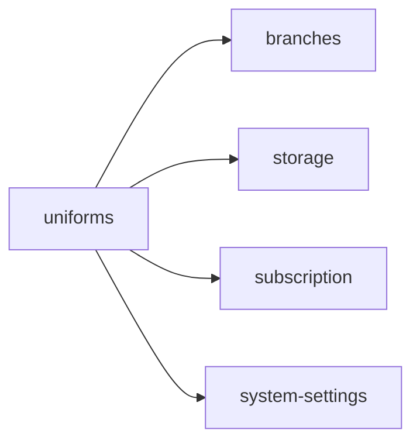

<!-- AUTO-GENERATED by scripts/generate-module-deps — do not edit -->

# Uniforms

## Dependency summary

| Fan-out | Fan-in | Hub rank | Blast radius | Dependency rate | Type |
|---------|--------|----------|--------------|-----------------|------|
| 4 | 4 | 14/61 | 4 | 13% | Standard |

- **Backend module:** `backend/src/modules/uniforms/uniforms.module.ts`
- **Category:** Uniforms & Inventory

## Depends on (outbound)

| Module | Layer | Via | Condition |
|--------|-------|-----|----------|
| branches | BE module | backend/src/modules/uniforms/uniforms.module.ts imports | — |
| storage | BE module | backend/src/modules/uniforms/uniforms.module.ts imports | — |
| subscription | BE module | backend/src/modules/uniforms/uniforms.module.ts imports | — |
| system-settings | BE module, BE service | backend/src/modules/uniforms/uniforms.module.ts imports; backend/src/modules/uniforms/uniforms.service.ts → SystemSettingsService | — |

## Depended on by (inbound)

| Consumer | Layer | Via | Condition |
|----------|-------|-----|----------|
| dashboard | FE feature | components/features/dashboard | — |
| dashboard | FE feature | widget:low_stock | plan: hasInventoryManagement |
| hook:useInventory | FE hook | /api/v1/uniforms | — |
| inventory | FE feature | components/features/inventory | — |
| sidebar | FE nav | /inventory | RBAC feature inventory |
| sidebar | FE nav | /inventory/items | RBAC feature inventory |
| sidebar | FE nav | /inventory/requests | RBAC feature inventory |
| sidebar | FE nav | /inventory/history | RBAC feature inventory |
| sidebar | FE nav | /uniform-request | RBAC feature inventory |
| uniform-issuances | BE module | backend/src/modules/uniform-issuances/uniform-issuances.module.ts imports | — |
| uniform-issuances | BE service | backend/src/modules/uniform-issuances/uniform-issuances.service.ts → UniformsService | — |
| uniform-requests | BE module | backend/src/modules/uniform-requests/uniform-requests.module.ts imports | — |
| uniform-requests | BE service | backend/src/modules/uniform-requests/uniform-requests.service.ts → UniformsService | — |

## Access gates

| Gate type | Condition | Applies to | Source |
|-----------|-----------|------------|--------|
| jwt | JwtAuthGuard | uniforms API | `backend/src/modules/uniforms/uniforms.controller.ts` |
| branch | BranchGuard (X-Branch-Id) | uniforms API | `backend/src/modules/uniforms/uniforms.controller.ts` |
| plan | RequiresFeature('hasInventoryManagement') | uniforms API | `backend/src/modules/uniforms/uniforms.controller.ts` |
| rbac | ensureFeatureEditAccess('inventory') | uniforms write endpoints | `backend/src/modules/uniforms/uniforms.controller.ts` |

## Database tables

| Table | Source file |
|-------|-------------|
| `branches` | `backend/src/modules/uniforms/uniforms.controller.ts` |
| `features` | `backend/src/modules/uniforms/uniforms.controller.ts` |
| `role_permissions` | `backend/src/modules/uniforms/uniforms.controller.ts` |
| `roles` | `backend/src/modules/uniforms/uniforms.controller.ts` |
| `uniform_items` | `backend/src/modules/uniforms/uniforms.service.ts` |
| `uniform_stock` | `backend/src/modules/uniforms/uniforms.service.ts` |

## Troubleshooting

| Symptom | Likely cause | Check first |
|---------|--------------|-------------|
| Feature locked or 403 | Subscription plan missing feature | `FeatureAccessGuard`, `useSubscriptionFeatures()` |
| Nav item dimmed/disabled | Plan gate on sidebar | `Sidebar.tsx` subscriptionNavFeatures |

## Dependency graph

