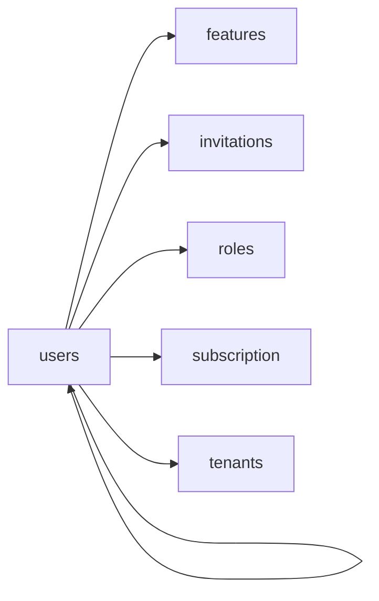

<!-- AUTO-GENERATED by scripts/generate-module-deps — do not edit -->

# Users

> **Aggregator module** — composes multiple other modules (often via frontend widgets/hooks).

## Dependency summary

| Fan-out | Fan-in | Hub rank | Blast radius | Dependency rate | Type |
|---------|--------|----------|--------------|-----------------|------|
| 5 | 2 | 29/61 | 15 | 11% | Aggregator |

- **Backend module:** `backend/src/modules/users/users.module.ts`
- **Frontend feature:** `frontend/src/components/features/users`
- **Category:** Core System

## Depends on (outbound)

| Module | Layer | Via | Condition |
|--------|-------|-----|----------|
| features | FE feature | components/features/users | — |
| invitations | BE module, BE service, FE feature | backend/src/modules/users/users.module.ts imports; backend/src/modules/users/users.service.ts → InvitationsService | — |
| roles | FE feature | components/features/users | — |
| subscription | BE module, BE service | backend/src/modules/users/users.module.ts imports; backend/src/modules/users/users.service.ts → SubscriptionService | — |
| tenants | FE feature | components/features/users | — |
| users | FE feature | components/features/users | — |

## Depended on by (inbound)

| Consumer | Layer | Via | Condition |
|----------|-------|-----|----------|
| hook:useUsers | FE hook | /api/v1/users | — |
| mapping | FE feature | components/features/mapping | — |
| parents | FE feature | components/features/parents | — |
| sidebar | FE nav | /users | RBAC feature user_management |
| users | FE feature | components/features/users | — |

## Access gates

| Gate type | Condition | Applies to | Source |
|-----------|-----------|------------|--------|
| jwt | JwtAuthGuard | users API | `backend/src/modules/users/users.controller.ts` |
| branch | BranchGuard (X-Branch-Id) | users API | `backend/src/modules/users/users.controller.ts` |
| rbac | ensureFeatureEditAccess('user_management') | users write endpoints | `backend/src/modules/users/users.controller.ts` |
| nav-rbac | canView('user_management') | nav path /users | `frontend/src/lib/permission/navFeatureMap.ts` |

## Database tables

| Table | Source file |
|-------|-------------|
| `branches` | `backend/src/modules/users/users.service.ts` |
| `class_sections` | `backend/src/modules/users/users.service.ts` |
| `features` | `backend/src/modules/users/users.controller.ts` |
| `invitations` | `backend/src/modules/users/users.service.ts` |
| `parent_students` | `backend/src/modules/users/users.service.ts` |
| `profiles` | `backend/src/modules/users/users.service.ts` |
| `role_permissions` | `backend/src/modules/users/users.controller.ts` |
| `roles` | `backend/src/modules/users/users.controller.ts` |
| `staff` | `backend/src/modules/users/users.service.ts` |
| `students` | `backend/src/modules/users/users.service.ts` |
| `teacher_assignments` | `backend/src/modules/users/users.service.ts` |
| `tenants` | `backend/src/modules/users/users.service.ts` |
| `user_branches` | `backend/src/modules/users/users.service.ts` |
| `user_roles` | `backend/src/modules/users/users.service.ts` |

## Troubleshooting

| Symptom | Likely cause | Check first |
|---------|--------------|-------------|
| API 401/403 | Auth, branch, or permission gate | Controller guards + `ensureFeatureEditAccess` |
| Empty list or wrong branch data | Missing branch_id filter | Service `.eq('branch_id', branchId)` |
| Frontend not loading data | Hook or API mismatch | `frontend/src/hooks/` + Network tab |

## Dependency graph

