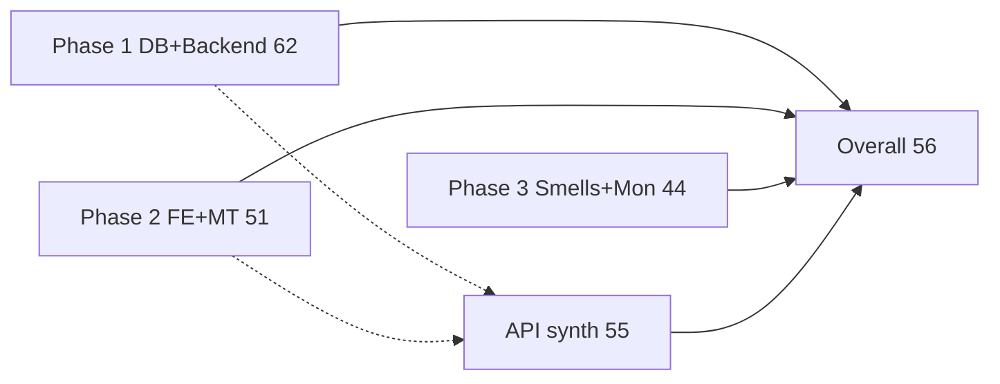

# Alma Deep Scan — Overall Rollup

**Date:** 24 Jul 2026  
**Method:** Weighted combination of Phases 1–3 per [docs/performance/deep-scan.md](deep-scan.md)  
**Constraint:** Read-only audit series — no application code changes from scan work

| Phase report | Categories | Phase composite |
|--------------|------------|-----------------|
| [DEEP_SCAN_1(DB-BACKEND)_Report.md](DEEP_SCAN_1(DB-BACKEND)_Report.md) | Database, Backend | **62** |
| [DEEP_SCAN_2(FRONTEND-MULTI-TENANT)_Report.md](DEEP_SCAN_2(FRONTEND-MULTI-TENANT)_Report.md) | Frontend, Multi-tenant | **51** |
| [DEEP_SCAN_3(CODE-SMELLS-MONITORING)_Report.md](DEEP_SCAN_3(CODE-SMELLS-MONITORING)_Report.md) | Code smells, Monitoring | **44** |

---

## Executive Summary

- **Overall score: 56/100** (Fair — moderate–significant work before confident multi-tenant scale)
- **Recommendation:** Fix **isolation criticals** and **noisy-neighbour backends** before wider go-live; add **minimum observability** (Sentry + readiness health + request IDs) in the same week so incidents are diagnosable.
- **Top 3 risks before go-live:**
  1. Cross-tenant API holes (`branches` list/get/update, guardians-by-student, public-stats mutate) — Phase 2
  2. Memory/CPU storms (school export in Nest memory, Puppeteer per PDF, notification fan-out) — Phase 1
  3. Blind ops (no APM, shallow `/health`, no correlation/tenant log tags) — Phase 3
- **Estimated effort to reach ~85+ overall:** ~6–8 person-weeks (isolation + export/PDF/queues + FE fan-out + monitoring foundation; god-file splits continue beyond)

### Status by rubric band

| Band | Meaning |
|------|---------|
| 90–100 | Production-ready at scale |
| 75–89 | Good, minor improvements |
| **60–74** | Fair, moderate refactoring — **Database alone is here** |
| **40–59** | Poor — **Backend, FE, MT, API, Smells, Monitoring, Overall** |
| 0–39 | Critical |

Overall **56** sits in the “poor–fair” border: shipable for controlled demos, **not** yet for unattended 50+ tenant production without the Week-1 list below.

---

## Category Scores (full audit weights)

| Category | Weight | Score | Status | Source |
|----------|-------:|------:|--------|--------|
| Database & Supabase | 25% | **70** | Fair | Phase 1 |
| Backend / NestJS | 20% | **52** | Poor | Phase 1 |
| Frontend / Next.js | 20% | **58** | Fair | Phase 2 |
| Multi-Tenant Isolation | 15% | **42** | Poor (harsh) | Phase 2 |
| API Performance & Network | 10% | **55** | Poor–Fair | **Synthesised Phase 3** (from P1/P2 evidence) |
| Code Smells & Duplication | 5% | **50** | Poor | Phase 3 |
| Monitoring & Observability | 5% | **38** | Critical | Phase 3 |
| **Overall (weighted)** | 100% | **56** | Poor–Fair | — |

### Weighted calculation

```
0.25×70 + 0.20×52 + 0.20×58 + 0.15×42 + 0.10×55 + 0.05×50 + 0.05×38
= 17.50 + 10.40 + 11.60 + 6.30 + 5.50 + 2.50 + 1.90
= 55.70 → 56/100
```

---

## API Performance synthesis (Category 5)

No separate deep network/HAR pass in Phase 3. Score **55/100** derived from Phase 1–2 findings:

| Evidence (prior phase) | Effect on API score |
|------------------------|---------------------|
| Admin dashboard ~10 parallel React Query mounts (P2) | −10 duplicate / fan-out load |
| Systemic oversized selects / `select('*')` + pagination gaps on some lists (P1) | −10 payload / DB chatter |
| No app-level rate limiting / `@nestjs/throttler` (P1 backend) | −12 noisy-neighbour amplification |
| Undebounced search (assessments, ID cards, fee payments) (P2) | −6 request storms from UI |
| Client waterfalls / eager reports & settings tabs (P2) | −5 under-batched UX paths |
| Missing HTTP caching headers (Cache-Control/ETag) on static-ish lookups (P1/P2 pattern) | −5 |
| Credits: `compression()` in Nest; TanStack Query client; dashboard Fix 4 `limit:1`+`meta.total` | +8 |

**Derivation note:** `100 − 10 − 10 − 12 − 6 − 5 − 5 + 8 = 60`, then −5 for remaining over-fetch / missing batch endpoints called out in deep-scan Category 5 → **55**.

This category overlaps Backend/Frontend scores by design; weight is only **10%** so double-counting does not dominate the overall.

---

## Top risks across all phases

| Priority | Risk | Phase | Category |
|----------|------|-------|----------|
| 1 | Unscoped `/api/v1/branches` list/get/update | 2 | Multi-tenant |
| 2 | Guardians-by-`studentId` IDOR; public-stats mutate IDOR | 2 | Multi-tenant |
| 3 | School data export materialises full tenant in Nest memory | 1 | Backend / MT noisy neighbour |
| 4 | Puppeteer `launch` per PDF (ID cards, challans, reports) | 1 | Backend / Smells duplication |
| 5 | Assessment publish / notification unbounded fan-out | 1 | Backend |
| 6 | Email-domain BranchGuard privilege (`@ntg.com` etc.) | 2 / 3 | Multi-tenant / Smells |
| 7 | No APM + shallow `/health` + no request/tenant log tags | 3 | Monitoring |
| 8 | Dashboard API fan-out + almost all portal pages `'use client'` | 2 | Frontend / API |
| 9 | ~295 live Supabase performance advisors (unindexed FKs, etc.) | 1 | Database |
| 10 | God services (`reports` ~3.7k LOC) blocking safe change | 3 | Code smells |

---

## Unified roadmap

### Week 1 — Safety + sight

**Isolation (Phase 2 C1–C5)**

- [ ] Scope `branches` APIs to membership / platform admin
- [ ] Public-stats mutate requires membership
- [ ] Guardians require student-in-branch
- [ ] Remove or env-gate email-domain privilege

**Noisy neighbour (Phase 1 C*)**

- [ ] Cap/queue school export; stream or chunk — do not hold full tenant in memory
- [ ] Concurrency caps on notification / grade fan-out remaining hot paths
- [ ] Start shared Puppeteer browser service (stop new per-call launches)

**Observability (Phase 3 C1–C3)**

- [ ] Sentry (or equivalent) on Nest + Next with tenant/branch tags
- [ ] `GET /health/ready` with DB ping; keep `/health` as liveness
- [ ] Request-ID middleware; enrich `HttpExceptionFilter`

**API / FE quick wins**

- [ ] Server rate limits on export / PDF ZIP / challan generate
- [ ] Debounce search inputs called out in Phase 2

### Weeks 2–4 — Load + structure

- [ ] BranchGuard short-TTL cache (Phase 1); Fix 8 pattern extended
- [ ] Advisor triage: top unindexed FKs on hot tables; unused-index review
- [ ] Dashboard aggregator endpoint or shared query keys; `next/dynamic` for recharts/heavy tabs
- [ ] Kill DynamicThemeProvider 300ms DOM polling
- [ ] ESLint `no-console` + `no-explicit-any` budget; replace hottest consoles
- [ ] Begin split of `reports.service` / `assessments.service` and settings/messages pages
- [ ] Document p95/p99 SLOs; alert on auth/export/PDF failure rates
- [ ] Cron flags + batching alignment (Phase 2 M9)

### Ongoing (post go-live hardening)

- [ ] Partition strategy when attendance / grades / audit_logs approach multi-million rows
- [ ] Full `select('*')` eradication CI gate
- [ ] Capture `next build` First Load JS for top routes in CI
- [ ] knip/madge unused-code pass after god splits
- [ ] Shared job queue for PDF, bulk import, email, export

---

## What improved already (do not reopen)

Credited across Phase 1–2 reports:

- Sprint 1: Auth Admin list storms, messages Realtime filter, attendance concurrency caps  
- Fixes 1–8: users email fallback, early-departure prefetch, leaves batch quota, dashboard `limit:1`, certificates lean list, results ZIP Chromium, subject report batching, JwtAuth/middleware Auth cache  

These lifted Backend/FE floors; remaining score gaps are **isolation**, **export/PDF**, **observability**, and **structural size**.

---

## Phase map



---

## Appendix — Per-category one-liners

| Category | One-line verdict |
|----------|------------------|
| Database 70 | Hot paths indexed; advisor debt and `select('*')` habits remain |
| Backend 52 | Export/PDF/fan-out still dominate risk despite Fixes 1–8 |
| Frontend 58 | Usable portal; client-heavy with dashboard/theme/search waste |
| Multi-tenant 42 | Must-fix IDOR/enumeration before scale |
| API 55 | Fan-out + no rate limits + fat selects; compression/Query help |
| Smells 50 | God files + duplication + `any`/console culture |
| Monitoring 38 | Cannot operate multi-tenant prod blind |

---

## Document control

| Artefact | Path |
|----------|------|
| Instructions | `docs/performance/deep-scan.md` |
| Phase 1 | `docs/performance/DEEP_SCAN_1(DB-BACKEND)_Report.md` |
| Phase 2 | `docs/performance/DEEP_SCAN_2(FRONTEND-MULTI-TENANT)_Report.md` |
| Phase 3 | `docs/performance/DEEP_SCAN_3(CODE-SMELLS-MONITORING)_Report.md` |
| **This rollup** | `docs/performance/DEEP_SCAN_OVERALL_Report.md` |
| Prior Nano context | `docs/performance/memory-load-reasons.md` |
