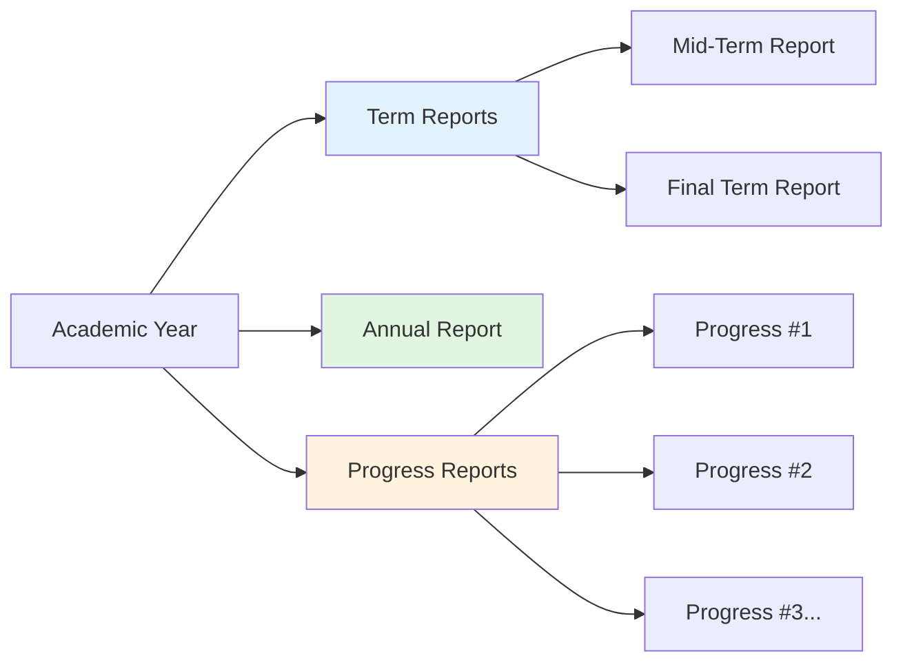
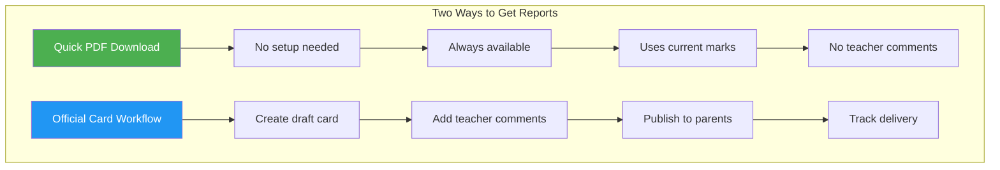
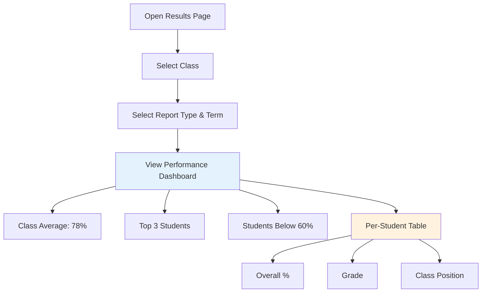
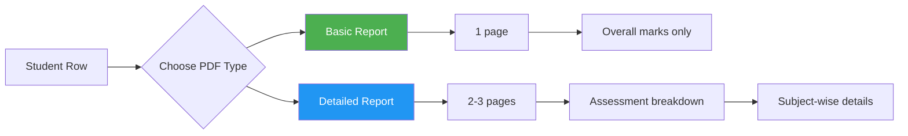
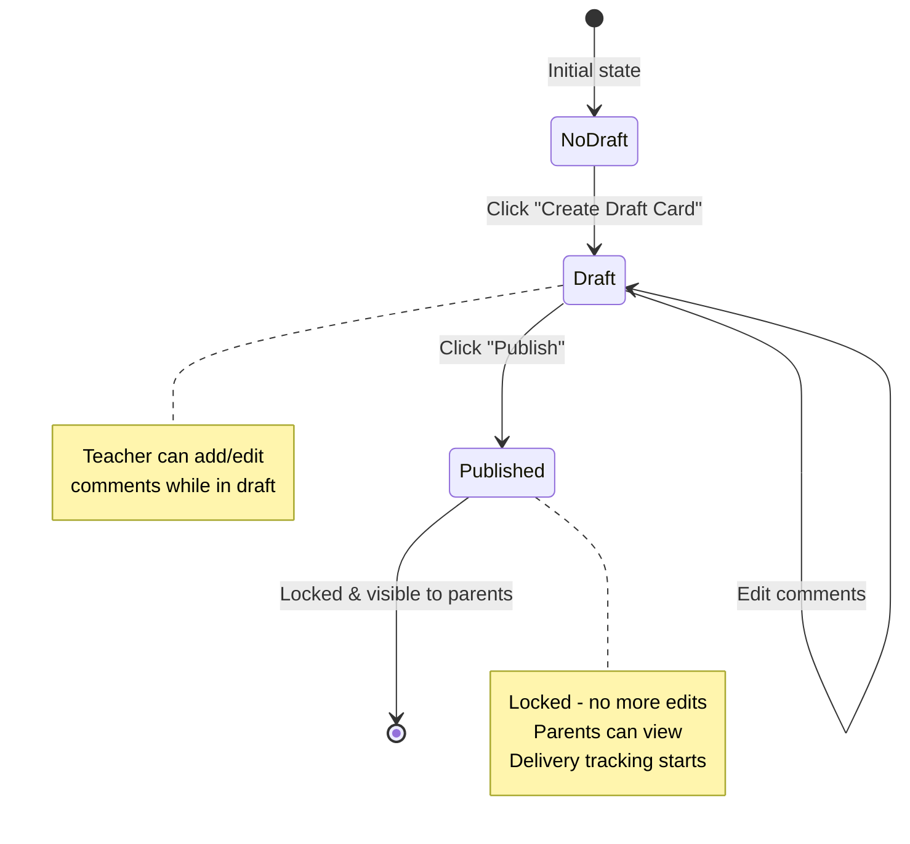
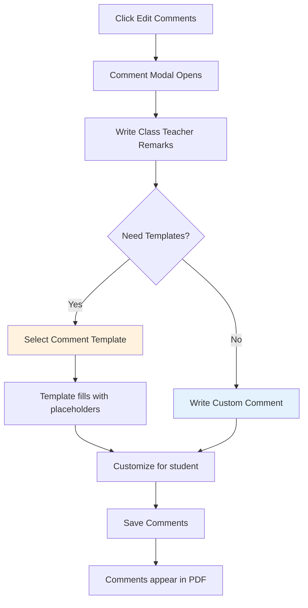
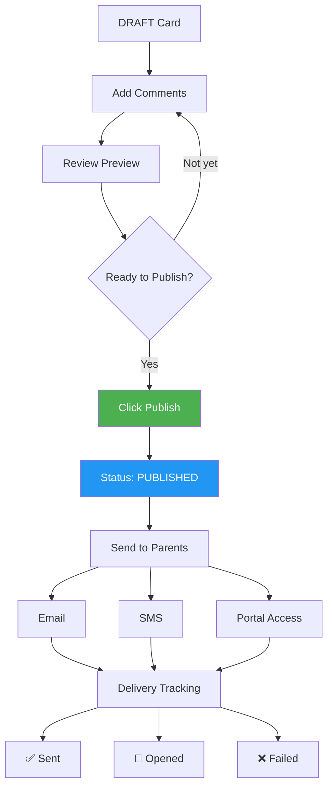

# 🥇 Results

**What you can do:**

* View class performance and individual student results
* Download PDF report cards (basic or detailed)
* Add teacher comments and publish official cards
* Send reports to parents via email/SMS
* Track which parents have received reports

***

### Key Concepts

#### Report Types



| Type                | When        | Purpose                  | Frequency                 |
| ------------------- | ----------- | ------------------------ | ------------------------- |
| **Term Report**     | End of term | Official term assessment | 2x per year (Mid + Final) |
| **Annual Report**   | End of year | Complete year summary    | 1x per year               |
| **Progress Report** | Anytime     | Informal parent update   | Multiple times            |

***

#### Cards vs PDFs



**Quick PDF (Instant)**

* ✅ Download anytime
* ✅ No database record
* ✅ Reflects latest marks
* ❌ No teacher comments
* **Use for:** Quick prints, parent requests, internal review

**Official Card (Full Workflow)**

* ✅ Teacher comments included
* ✅ Publish/lock mechanism
* ✅ Delivery tracking
* ✅ Parent portal visibility
* **Use for:** Official term reports, formal distribution

***

#### Grading System

Default grading scale (configurable in settings):

| Grade | Percentage | Description       |
| ----- | ---------- | ----------------- |
| A+    | 90-100%    | Outstanding       |
| A     | 80-89%     | Excellent         |
| B     | 70-79%     | Good              |
| C     | 60-69%     | Satisfactory      |
| D     | 50-59%     | Needs Improvement |
| F     | Below 50%  | Fail              |

***

### Getting Started

#### Prerequisites

Before generating result cards, ensure:

1. ✅ **Assessments are entered** - All quizzes, tests, assignments marked
2. ✅ **Class is active** - Students enrolled in correct class-section
3. ✅ **Academic year set** - Current year configured
4. ✅ **Grading scale defined** - In settings (if customizing)

***

### Main Workflows

#### Workflow 1: Viewing Class Results

**Location:** Results → Select class



**Steps:**

1. Navigate to **Results** from sidebar
2. **Select Class** - Choose class-section (e.g., Class II-C)
3. **Select Report Type** - Term Report / Annual Report / Progress Report
4. **Select Term** (if Term Report) - Mid-term / Final Term

**Dashboard shows:**

* 📊 Class statistics (average, median, top students)
* 📈 Performance distribution
* ⚠️ Students needing attention (below threshold)
* 📋 Student-wise breakdown table

***

#### Workflow 2: Downloading PDF Reports



**For Individual Student:**

1. Find student in results table
2. Click **Actions** menu (⋮)
3. Choose:
   * **Download Basic PDF** - Quick 1-page summary
   * **Download Detailed PDF** - Full assessment breakdown
4. PDF downloads instantly

**For Entire Class:**

1. Click **"Download All (ZIP)"** button (top right)
2. Select PDF type (Basic or Detailed)
3. System generates ZIP file with all student PDFs
4. Download and extract

**PDF Variants:**

* **Modern** - Colorful, digital-friendly (default)
* **Minimal** - Black & white, print-optimized
* Change in Settings → Results → PDF Appearance

***

#### Workflow 3: Creating Official Cards



**When to create cards:** Only when you want to add teacher comments or officially publish to parents.

**Steps:**

1. From results table, click **Actions** → **Create Draft Card**
2. System creates database record with current marks snapshot
3. Status shows: **DRAFT** 🟡
4. Click **Edit Comments** to add teacher remarks
5. Click **Publish** when ready
6. Status changes to: **PUBLISHED** ✅

**Card Status:**

* **No Card** - PDF available, no official card yet
* **DRAFT** 🟡 - Card created, can edit comments
* **PUBLISHED** ✅ - Locked, visible to parents

***

#### Workflow 4: Adding Teacher Comments

**Location:** Results → Actions → Edit Comments



**Types of Comments:**

1. **Class Teacher Remarks** (Main comment)
   * Overall performance assessment
   * Behavioral observations
   * Recommendations
2. **Subject Teacher Remarks** (Per subject - optional)
   * Specific subject strengths/weaknesses
   * Areas for improvement

**Comment Templates:**

Use pre-written templates for common scenarios:

* "Excellent performance throughout the term..."
* "Shows potential but needs more focus on..."
* "Consistent performer with good attendance..."

**Edit template with:**

* `{{student_name}}` → Ayesha
* `{{best_subject}}` → Mathematics
* `{{percentage}}` → 87%

***

#### Workflow 5: Publishing & Distribution



**Publishing:**

1. Ensure all comments are complete
2. Click **Actions** → **Preview** (optional - check before publishing)
3. Click **Publish Card**
4. Confirmation: "Publish will lock the card. Continue?"
5. Click **Confirm**

**After Publishing:**

* ✅ Card is locked (no more edits)
* ✅ Visible on parent portal
* ✅ Ready for distribution

**Sending to Parents:**

1. Click **Actions** → **Send to Parents**
2. Select delivery method:
   * ☑️ Email (sends PDF attachment)
   * ☑️ SMS (sends portal link)
   * ☑️ Portal notification
3. Select recipients (Mother, Father, Guardian)
4. Click **Send**

**Tracking Delivery:**

View delivery status in Actions menu:

* ✅ **Sent** - Delivered successfully
* 📧 **Opened** - Parent opened email/viewed PDF
* ⏳ **Pending** - In progress
* ❌ **Failed** - Delivery error (check contact info)

***

### Report Types Explained

#### 1. Term Report Card

**Content:**

* Subject-wise marks, percentages, grades
* Assessment breakdown (quizzes, assignments, exams)
* Overall term performance
* Attendance percentage
* Conduct grade
* Class teacher remarks
* Principal's message

**When to use:** End of Mid-term or Final Term

**Example:**

```
Student: Ayesha Tarar | Class II-C | Final Term

Mathematics     92/100 (92%)  [A+]
  • Quizzes: 28/30
  • Assignments: 18/20
  • Final Exam: 46/50

English         85/100 (85%)  [A]
Science         78/100 (78%)  [B]
...

Overall: 87.6% [A+] | Attendance: 95% | Conduct: A

Teacher's Remarks: Ayesha has shown excellent 
performance this term. Strong in Mathematics...
```

***

#### 2. Annual Report Card

**Content:**

* **Everything from Term Report, PLUS:**
* Mid-term vs Final term comparison
* Annual total marks and average
* Promotion status (Promoted/Detained)
* Next class assignment
* Achievements & awards during year
* Co-curricular activities participation
* Annual attendance summary

**When to use:** End of academic year

**Example:**

```
Academic Year 2028-2029 Summary

           Mid-Term  Final    Annual
Math       90%       92%      91%
English    82%       85%      83.5%
Overall    85%       87.6%    86.3%

Status: PROMOTED to Class III
Annual Attendance: 94% (282/300 days)

Achievements:
🏆 Mathematics Quiz - 1st Position
📚 Class Topper - Mid-term
🎨 Art Exhibition Participant
```

***

#### 3. Progress Report

**Content:**

* Recent assessments only (last 2 weeks or 5 assessments)
* Current class average
* Attendance status (warning if below 90%)
* Areas requiring attention
* Teacher's recent observations
* Recommended action items

**When to use:**

* Parent-teacher meeting follow-ups
* Early warning (student struggling)
* Monthly check-ins between terms

**Example:**

```
Progress Update - November 15, 2028

Recent Assessments:
• Math Unit Test 3: 18/20 ✅
• English Assignment: 15/20 ⚠️
• Science Practical: 12/15 ✅

Current Average: 85%
Attendance: 88% ⚠️ (Below 90% target)

Areas Needing Attention:
⚠️ Attendance - Please ensure regular attendance
⚠️ Science practical skills need practice
⚠️ 2 late homework submissions

Action Items:
□ Improve attendance to 95%
□ Practice Science experiments at home
□ Create homework schedule
```

***

### Common Scenarios

#### Scenario 1: End of Term - Bulk Report Generation

**Goal:** Generate and send reports to entire class

```
1. Results → Select Class II-C → Final Term
2. Review dashboard (check for missing marks)
3. Click "Download All (ZIP)" → Basic PDF
4. Download ZIP with all 30 student PDFs
5. Share via email/WhatsApp to parents

Optional (for official cards with comments):
6. Click "Bulk Create Cards" → Creates drafts for all
7. Add comments individually or use templates
8. Select all → Bulk Publish
9. Select all → Send to Parents (Email)
```

**Time: 10-15 minutes for 30 students**

***

#### Scenario 2: Student Joins Mid-Term

**Goal:** Generate report with limited data

```
Student: Ali Hassan (joined October 15, mid-term)

1. Results → Select class
2. Find Ali Hassan → Actions → Create Draft Card
3. System marks assessments "N/A" for missed ones
4. Calculates % from available assessments only
5. Add comment: "Joined mid-term - assessment from October onwards"
6. Publish normally

PDF shows:
Mathematics: 85% (calculated from 3/5 assessments)
Note: "Student enrolled mid-term"
```

***

#### Scenario 3: Parent Requests Report Before Publishing

**Goal:** Give parent a quick report without publishing

```
1. Results → Find student
2. Actions → Download Basic PDF
3. PDF generates instantly (no card needed)
4. Send to parent

Note: This PDF won't have teacher comments
For official report with comments, complete full workflow
```

***

#### Scenario 4: Correcting Published Report

**Problem:** Found error in marks after publishing

```
IMPORTANT: Published cards are locked

Option A - Before Any Delivery:
1. Contact administrator to unpublish
2. Fix marks in Assessments module
3. Actions → Update from Latest Marks
4. Review and re-publish

Option B - After Parent Delivery:
1. Fix marks in Assessments module  
2. Create new card (mark as "Revised")
3. Add note: "This replaces previous report (error correction)"
4. Publish as "Revised Report"
5. Send to parents with explanation email

School policy: Get principal approval for post-delivery revisions
```

***

#### Scenario 5: Student Absent for Assessments

**Goal:** Handle missing marks properly

```
Assessment: Final Exam - English

Student was absent (medical leave)

In Assessments module:
• Mark status as "Absent" (not 0 marks)
• This shows "ABS" instead of score
• Doesn't count toward percentage calculation

On Report Card:
English: 80% (calculated from 4/5 assessments)
Final Exam: ABS

Comment: "Final exam missed due to medical leave"
```

***

### Quick Reference

#### Status Indicators

| Icon/Badge      | Meaning                      | Action Available          |
| --------------- | ---------------------------- | ------------------------- |
| **No Card**     | No official card created yet | Create Draft Card         |
| **DRAFT** 🟡    | Card in progress             | Edit Comments, Publish    |
| **PUBLISHED** ✅ | Locked & official            | Send to Parents, Download |
| **Sent** 📧     | Delivered to parent          | Track Opens, Resend       |

#### Button Quick Guide

| Button              | What it Does                    | When to Use                     |
| ------------------- | ------------------------------- | ------------------------------- |
| **Download PDF**    | Instant PDF from current marks  | Anytime - no card needed        |
| **Create Draft**    | Start official card workflow    | When adding comments/publishing |
| **Edit Comments**   | Add teacher remarks             | Before publishing               |
| **Publish**         | Lock card & make official       | When ready for parents          |
| **Send to Parents** | Email/SMS delivery              | After publishing                |
| **Update Marks**    | Refresh from latest assessments | When marks changed after draft  |

***

### Keyboard Shortcuts

| Shortcut       | Action                                |
| -------------- | ------------------------------------- |
| `Ctrl + D`     | Download selected student PDF         |
| `Ctrl + P`     | Preview current report                |
| `Ctrl + Enter` | Publish draft (confirmation required) |
| `Esc`          | Close modal/cancel action             |

***

### Tips & Best Practices

✅ **Generate drafts in bulk** - Create all cards at once, add comments individually\
✅ **Use comment templates** - Save time with pre-written remarks\
✅ **Preview before publishing** - Catch errors early\
✅ **Download PDFs first** - Test appearance before sending to parents\
✅ **Track delivery status** - Follow up on failed deliveries\
✅ **Set consistent due dates** - Configure per class in settings\
✅ **Regular progress reports** - Keep parents informed between terms

***

### Troubleshooting

#### PDF Not Generating?

**Check:**

* ✓ All assessment marks entered?
* ✓ Student enrolled in correct class?
* ✓ Browser pop-up blocker disabled?

**Try:**

* Refresh page and retry
* Use different browser
* Contact IT if persists

***

#### Parent Can't See Published Card?

**Check:**

* ✓ Card status is PUBLISHED (not Draft)?
* ✓ Parent has portal access?
* ✓ Parent linked to correct student?
* ✓ Academic year set correctly?

**Try:**

* Resend portal invitation to parent
* Check parent email/contact info

***

#### Marks Changed After Publishing?

**Options:**

1. **Minor changes** - Generate new "Revised Report"
2. **Major errors** - Request admin unpublish, fix, re-publish
3. **Always** - Document reason for revision

***

#### Can't Add Comments to Card?

**Check:**

* ✓ Card is in DRAFT status? (Can't edit published cards)
* ✓ You have teacher/admin permissions?

**Solution:**

* If published: Generate new card with corrections
* If draft: Try refreshing page

***

### Need Help?

Contact Us

***

**Last Updated:** May 2026 | Version 1.0
